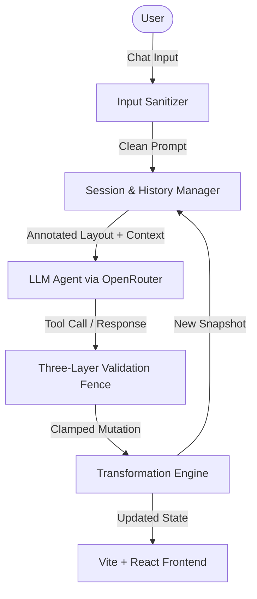

# Chat-Based Layout Agent

A conversational AI layout mutation system. It processes natural language instructions from users to dynamically mutate complex design layouts represented as JSON, complete with coordinate sync, proportional reflow, real-time wireframe previewing, and an interactive trace inspector.



---

## 🌟 Key Features

* **Semantic Role Annotation**: Enriches raw node IDs (e.g., `text_1778486306230_8`) with human-readable semantic roles (`headline`, `offer_badge`, `product_image`) prior to LLM evaluation. This enables the model to reason using natural design vocabulary instead of opaque identifiers.
* **Three-Layer Guardrail Fence**:
  1. **Dynamic enum constraint**: Limits the LLM to valid element IDs currently loaded in the active canvas.
  2. **Field allowlist**: Prevents mutations to unauthorized fields.
  3. **Absolute bounds clamping**: Protects layout integrity by verifying values and scaling normalized coordinates.
* **Proportional Canvas Reflow**: Resizing the canvas (e.g., switching from `1:1` to `9:16` ratio) automatically reflows all non-locked elements and font-sizes proportionally while maintaining aspect integrity.
* **Immutable State & Snapshotting**: Deep-copy snapshotting records layout states, allowing full **Undo** and **Redo** operations across past turns without re-querying the LLM.
* **LangSmith-like Local Monitoring**: Real-time tracing captures latency, prompt templates, raw OpenRouter responses, validations, and final applied mutations.

---

## 📁 Repository Structure

```text
compra_assignment/
├── app/
│   ├── main.py              # FastAPI core app & endpoints definition
│   ├── data/
│   │   ├── data.json        # Input canvas layout (13 nodes, 1080×1080)
│   │   └── traces.jsonl     # Persistent operational logs for tracing
│   ├── models/
│   │   ├── commands.py      # Envelope response wrappers for API response
│   │   ├── layout.py        # Pydantic definitions for Canvas elements
│   │   ├── mutation.py      # Pydantic schemas for LLM mutations
│   │   └── session.py       # Session structure configuration
│   ├── prompts/
│   │   └── system.txt       # Dynamic LLM instruction prompt template
│   ├── schemas/
│   │   └── mutation_schema.json # JSON Schema describing mutation tools
│   └── services/
│       ├── annotator.py      # Semantic tagging and descriptor formatting
│       ├── llm.py            # OpenRouter model fallback execution engine
│       ├── loader.py         # Canvas state initializers
│       ├── parser.py         # Static keyword fallback parsers
│       ├── resolver.py       # Group target resolution
│       ├── sanitiser.py      # Input security filtering
│       ├── session.py        # Snapshot manager for Undo/Redo queues
│       ├── tracing.py        # Performance logging for debug console
│       ├── transformer.py    # Math layout transformation & reflow logic
│       └── validator.py      # Coordinates clamping and enum guards
├── frontend/                # Vite React App frontend directory
│   ├── src/
│   │   ├── components/
│   │   │   ├── ChatPane.tsx      # Conversational panel with Undo/Redo buttons
│   │   │   ├── PreviewCanvas.tsx # Real-time interactive canvas render
│   │   │   ├── JsonViewer.tsx    # Live JSON structure inspector
│   │   │   └── TracesViewer.tsx  # LangSmith-like diagnostic log viewer
│   │   ├── lib/
│   │   │   ├── api.ts            # Client HTTP handlers
│   │   │   └── colors.ts         # Wireframe aesthetic palette
│   │   └── App.tsx               # Main application layout manager
├── main.py                  # Server entry point
├── pyproject.toml           # Project metadata and dependencies
└── requirements.txt         # Package build manifest
```

---

## 🚀 Setup & Installation

> [!IMPORTANT]
> Ensure you have **Python 3.12+** and **Node.js 18+** installed on your machine before starting.

### 1. Prerequisites
It is highly recommended to use **[uv](https://github.com/astral-sh/uv)**, a fast Python package installer and resolver.
```bash
# Install uv globally if you haven't already
curl -LsSf https://astral.sh/uv/install.sh | sh
```

### 2. Backend Setup
1. From the project root, synchronize virtual environment and dependencies:
   ```bash
   uv sync
   ```
2. Create your environment configuration file:
   ```bash
   # Add your OpenRouter API Key
   echo "OPENROUTER_KEY=your_openrouter_api_key_here" > .env
   ```
3. Start the FastAPI backend server:
   ```bash
   uv run python main.py
   ```
   * The server runs locally at: `http://localhost:8000`
   * Swagger Interactive Documentation is available at: `http://localhost:8000/docs`

### 3. Frontend Setup
1. Open a new terminal and navigate to the frontend directory:
   ```bash
   cd frontend
   ```
2. Install Node dependencies:
   ```bash
   npm install
   ```
3. Boot up the Vite dev server:
   ```bash
   npm run dev
   ```
   * The React application will launch at: `http://localhost:5173`

---

## 🛠️ API Documentation

| Method | Endpoint | Description |
| :--- | :--- | :--- |
| `POST` | `/chat` | Processes incoming natural language prompts, coordinates mutations, and appends to snapshots. |
| `POST` | `/undo` | Pops the last snapshot from the layout stack to revert changes. |
| `POST` | `/redo` | Re-applies the last undone mutation. |
| `GET` | `/layout` | Fetches the current, fully annotated layout state. |
| `GET` | `/traces` | Fetches captured LLM inputs, prompt envelopes, and tool call outputs. |
| `POST` | `/traces/clear` | Clears all diagnostic traces. |

---

## 💡 Usage Examples

Try sending the following prompt templates in the chat pane to test out different layout capabilities:

* **Canvas Reflowing**: 
  * *"Convert this design to 9:16"*
  * *"Change the canvas aspect ratio to a horizontal banner"*
* **Repositioning Elements**:
  * *"Move the headline to the top of the canvas"*
  * *"Align the offer text below the social proof block"*
* **Resizing & Styling**:
  * *"Make the headline smaller"*
  * *"Increase the font size of the luxury offer banner"*
* **Anaphora Resolution (Context Awareness)**:
  * Turn 1: *"Select the product image and make it larger"*
  * Turn 2: *"Now shift it to the center"*
